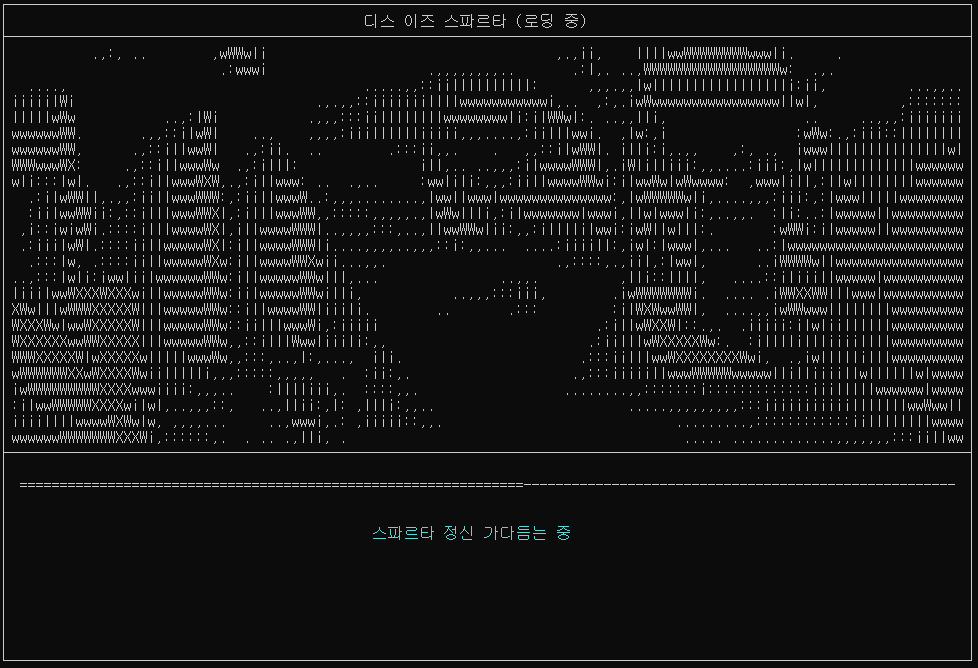
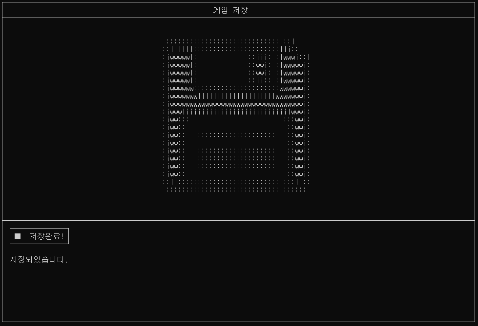
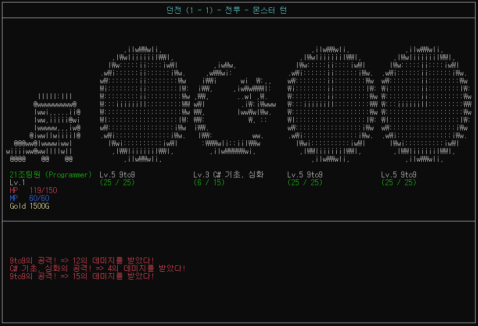

# 👨‍🔧 Team_SpartaTextRPG ( 디스 이즈 스파르타 )
### [Team21] C# 기초다지조 ( 21조 )

  
### **팀장 - 김용정**  
### 팀원 - 배리안  
### 팀원 - 남태현  
### 팀원 - 백근욱  
### 팀원 - 박진우  

<br>

# 🎮 게임 실행 화면 프리뷰
  
메인 로딩 씬에서 던전 입장 씬까지의 대략적인 실행 화면 입니다

<br>

# 🔧 환경 설정
Emgu.CV는 **only windows만 지원**하며 .net 8.0으로 빌드 후 .exe 파일 실행!

Window11로 실행 시에는 관리자 권한으로 실행해야 콘솔 사이즈가 알맞게 실행이 됩니다!

<br>

# 📦 사용된 라이브러리
> 🧱 Newtonsoft.Json  
> 🎨 System.Drawing.Common  
> 🎥 Emgu.CV  
> 🎥 Emgu.CV.Bitmap  
> 🎥 Emgu.CV.runtime.windows  

<br>

# 📂 폴더 구조
```bash
📦Team_SpartaTextRPG
 ┣ 📂Team_SpartaTextRPG
 ┃ ┣ 📂bin
 ┃ ┃ ┗ 📂Debug
 ┃ ┃ ┃ ┗ 📂net8.0
 ┃ ┃ ┃ ┃ ┣ 📂resources
 ┃ ┃ ┃ ┃ ┃ ┗ 📜more... !! NEED !!
 ┃ ┃ ┃ ┃ ┣ 📜Team_SpartaTextRPG.exe
 ┃ ┃ ┃ ┃ ┗ 📜more...
 ┃ ┣ 📂Char
 ┃ ┃ ┣ 📂Monster
 ┃ ┃ ┃ ┗ 📜Monster.cs
 ┃ ┃ ┣ 📂Player
 ┃ ┃ ┃ ┗ 📜Player.cs
 ┃ ┃ ┗ 📜ICharacter.cs
 ┃ ┣ 📂Helper
 ┃ ┃ ┣ 📜Singleton.cs
 ┃ ┃ ┗ 📜Utill.cs
 ┃ ┣ 📂Item
 ┃ ┃ ┣ 📜Buff.cs
 ┃ ┃ ┣ 📜Equip_Item.cs
 ┃ ┃ ┣ 📜Item.cs
 ┃ ┃ ┗ 📜Usable_Item.cs
 ┃ ┣ 📂Managers
 ┃ ┃ ┣ 📂AsciiArt
 ┃ ┃ ┃ ┣ 📜CursorManager.cs
 ┃ ┃ ┃ ┣ 📜InputKeyManager.cs
 ┃ ┃ ┃ ┣ 📜PanelManager.cs
 ┃ ┃ ┃ ┣ 📜ScreenManager.cs
 ┃ ┃ ┃ ┗ 📜TitleManager.cs
 ┃ ┃ ┣ 📜GameManager.cs
 ┃ ┃ ┣ 📜QuestManager.cs
 ┃ ┃ ┣ 📜SaveLoadManager.cs
 ┃ ┃ ┣ 📜SceneManager.cs
 ┃ ┃ ┗ 📜SkillManager.cs
 ┃ ┣ 📂Quest
 ┃ ┃ ┗ 📜Quest.cs
 ┃ ┣ 📂Scene
 ┃ ┃ ┣ 📜DungeonScene.cs
 ┃ ┃ ┣ 📜EndingScene.cs
 ┃ ┃ ┣ 📜InventoryScene.cs
 ┃ ┃ ┣ 📜QuestBoardScene.cs
 ┃ ┃ ┣ 📜RestScene.cs
 ┃ ┃ ┣ 📜ShopScene.cs
 ┃ ┃ ┣ 📜StartScene.cs
 ┃ ┃ ┣ 📜StatusScene.cs
 ┃ ┃ ┗ 📜TownScene.cs
 ┃ ┣ 📂Skill
 ┃ ┃ ┗ 📜Skill.cs
 ┃ ┣ 📜Maingame.cs
 ┃ ┣ 📜Program.cs
 ┃ ┗ 📜Team_SpartaTextRPG.csproj
 ┣ 📜README.md
 ┗ 📜Team_SpartaTextRPG.sln
```

<br>

# 💻 씬 구조

## 메인 로딩 화면
  
로딩화면과 함께 디스 이즈 스파르타 장면이 연출됩니다.

## 시작 화면
  
시작화면입니다. 저장된 데이터가 있을 시 계속하기 버튼이 활성화 됩니다.


<br>

## 새 게임 (이름 정하기)
  
자신의 이름을 쓸 수 있습니다(3~5 글자 제한)

  
이후 재미있는 애니메이션과 함께 닉네임을 확정 지을 지 말지 결정 할 수 있습니다


<br>

## 새 게임 (직업 정하기)
  
직업은 프로그래머와 기획자 두가지가 존재합니다


<br>

## 로비
  
로비화면은 스파르타 코딩클럽 Unity 7기의 Zep 공간에서의 책상을 표현하였습니다.


<br>

## 상태보기
  
상태보기에서는 자신의 정보와 장비된 아이템들을 확인해 볼 수 있습니다.


<br>

## 인벤토리
  
인벤토리에서 자신이 구매한 아이템들을 확인 하고 관리를 눌러 장비할 수 있습니다

<br>

  

<br>

## 상점
  
상점에서는 아이템과 소비템을 구매하거나 팔 수 있습니다

  
장착 아이템은 5종류로 나뉘어지며 색깔마다 낄 수 있는 부위가 다릅니다

  
소비 아이템은 바로 쓸 수 있으며 턴수 제한이 있습니다.

  
아이템을 팔 수 있습니다.

<br>

## 여관
  
500 G를 내고 쉴 수 있습니다 (단, 확률이 존재)


<br>

## 퀘스트
  
퀘스트 창에서 퀘스트를 받거나 퀘스트를 깨서 보상을 받을 수 있습니다


<br>

## 저장하기
  
로비에서 저장을 들어오면 데이터는 바로 저장이 되어 다음 플레이 할 때 계속하기 버튼을 눌러 현재 상태로 돌아 올 수 있습니다


<br>

## 던전
  
던전입구이여 스테이지로 입잘 할 수 있습니다


<br>

## 던전 - 전투
  
던전에는 스테이지마다 1~4명의 적들이 등장합니다


<br>

## 던전 - 상대 선택
  
상대를 선택하여 공격 할 수 있습니다


<br>

## 던전 - 플레이어 턴
  
매 턴마다 플레이어가 먼저 공격합니다


<br>

## 던전 - 몬스터 턴 이후 전투 결과
  
플레이어가 먼저 공격 한 뒤엔 남은 몬스터가 한명 씩 번갈라가며 플레이어를 공격합니다


<br>

## 던전 - 스킬 사용
  
스킬 사용 시 직업에 따라 부여된 스킬을 사용 할 수 있습니다


<br>

## 던전 - 몬스터 쓰러짐 상태
  
몬스터가 체력이 다하면 바닥에 쓰러집니다


<br>

## 던전 - 아이템 사용
  
아이템이 있다면 사용 할 수 있습니다 (사용한 뒤 효과는 턴 수가 지나면 효과 해제)


<br>

## 던전 - 전투 결과
  
몬스터를 모두 물리쳤을 시 보상을 받습니다


<br>

## 던전 - 스테이지 해금
  
던전에서 높은 스테이지로 갈 시 점점 스테이지가 해금됩니다


<br>

## 던전 - 보스 스테이지
  
보스 스테이지에 다다르면 던전이 빨갛게 물듭니다


<br>

## 엔딩
  
보스를 클리어하면 엔딩 크리딧과 함께 게임이 종료됩니다
